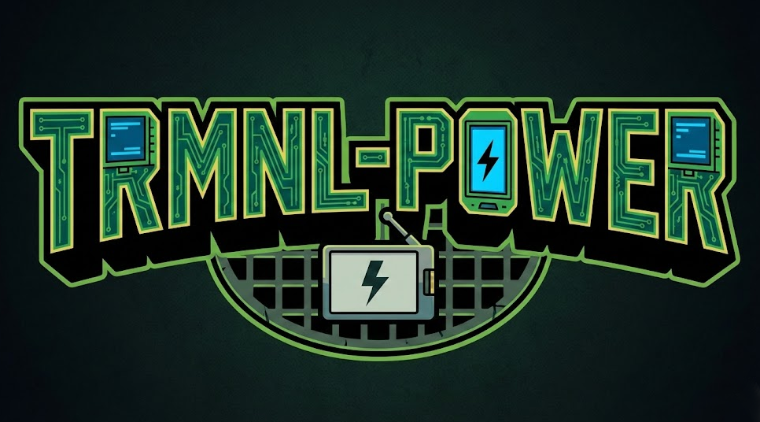
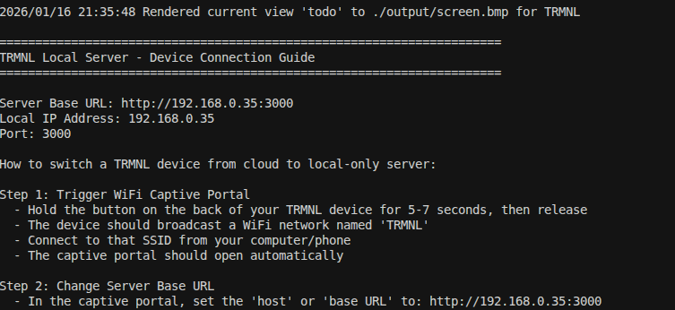
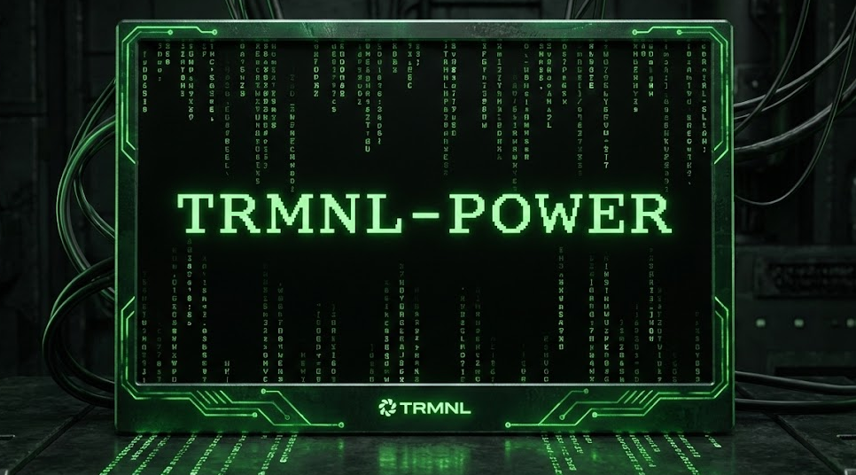

# TRMNL-POWER



> **Local-first rendering server for TRMNL e-ink displays**  
> Transform your data into beautiful e-ink dashboards with a simple templating system.

---

## What is TRMNL-POWER?

TRMNL-POWER is a lightweight Go server that creates beautiful e-ink displays for your TRMNL device. Instead of relying on cloud services, you run everything locally on your network. This gives you:

- 🔒 **Privacy**: Your data stays on your local network
- ⚡ **Speed**: No internet latency - instant updates
- 🎨 **Control**: Customize every aspect with HTML templates
- 🔧 **Flexibility**: Connect any data source - JSON files, APIs, scripts

### Why Use TRMNL-POWER?

**Tired of cloud-only solutions?** TRMNL-POWER lets you build custom dashboards that run entirely on your local network. Perfect for home automation, system monitoring, personal dashboards, or any data you want to display on e-ink.

**Love customization?** Our templating system lets you create exactly the display you want. Start with included templates (dashboard, todo lists, chores) or build your own from scratch.

**Want simplicity?** Just point it at your data (JSON files, local APIs), configure your templates, and let it run. The server handles all the rendering, image conversion, and serving automatically.

---

## Key Features

### 📊 Flexible Templating System
- **HTML-based templates** - Use familiar HTML/CSS to design your displays
- **Data binding** - Connect JSON fields directly to template variables
- **Multiple views** - Rotate between different dashboards automatically
- **E-ink optimized** - Built-in styles for high-contrast, readable displays

### 📡 Multiple Data Sources
- **JSON files** - Simple, local data storage
- **API endpoints** - Connect to local services
- **Scripts** - Run custom data collection scripts
- **Easy to extend** - Add your own data collectors

### 🖼️ Smart Rendering
- **Playwright-powered** - Reliable HTML-to-image conversion
- **E-ink optimized** - Automatic 1-bit monochrome conversion
- **Auto-refresh** - Scheduled updates keep your display current
- **View rotation** - Automatically cycle through different views

### 🌐 TRMNL Integration
- **Local-only** - No cloud dependency
- **Easy setup** - Captive portal configuration guide included
- **Stable endpoints** - Follows TRMNL device protocols
- **Zero-config routing** - Works with your existing TRMNL device

---

## Quick Start

### Prerequisites

- **Go 1.24+** - [Download Go](https://go.dev/dl/)
- **Node.js** - For Playwright rendering (included with install)
- **TRMNL Device** - Any TRMNL e-ink display

### Installation

1. **Clone the repository**
   ```bash
   git clone <repository-url>
   cd TRMNL-POWER
   ```

2. **Install dependencies**
   ```bash
   go mod download
   npm install  # Installs Playwright for rendering
   ```

3. **Configure your server**
   Edit `config.json`:
   ```json
   {
     "server": {
       "port": "3000",
       "host": "0.0.0.0"
     },
     "render": {
       "width": 800,
       "height": 480,
       "refreshIntervalMinutes": 5
     },
     "trmnl": {
       "apiKey": "your-secret-key",
       "friendlyId": "my-trmnl-display",
       "refreshRateSeconds": 300
     }
   }
   ```

4. **Add your data**
   Create JSON files in the `data/` directory. See `data/example.json` for format.

5. **Build and run**
   ```bash
   ./scripts/reload.sh
   # Or manually:
   go build -o trmnl-renderer .
   ./trmnl-renderer
   ```

The server will start and display connection instructions with your local IP address!

### Windows Users (Pre-built Release)

1. **Download the latest release** from [GitHub Releases](https://github.com/niski84/TRMNL-POWER/releases)
2. **Extract the ZIP file** to a folder
3. **Run `run.bat`** - It will automatically:
   - Check for Node.js (install from [nodejs.org](https://nodejs.org/) if needed)
   - Install Playwright on first run
   - Start the server

That's it! No manual npm installs needed.

---

## Screenshots



*TRMNL-POWER server showing startup help and connection guide*

---

## Using the Templating System

TRMNL-POWER's templating system makes it easy to create custom displays. Templates are HTML files that use Go's template syntax.

### Basic Template Structure

```html
<!DOCTYPE html>
<html>
<head>
  <meta charset="UTF-8">
  <meta name="viewport" content="width=800, height=480">
  <title>My Dashboard</title>
  <style>
    {{.Styles}}
  </style>
</head>
<body>
  <div class="header">
    <div class="header-title">{{.Title}}</div>
    <div class="header-timestamp">{{.Timestamp}}</div>
  </div>
  <div class="content">
    <!-- Your content here -->
  </div>
</body>
</html>
```

### Using Data Fields

Access JSON data in templates using the `Fields` map:

```html
<div class="card">
  <div class="card-label">Temperature</div>
  <div class="card-value">{{index .Fields "Temperature"}}</div>
  <div class="card-unit">{{index .Fields "TemperatureUnit"}}</div>
</div>
```

### JSON Data Format

Your JSON files should have a `fields` object:

```json
{
  "title": "My Dashboard",
  "timestamp": "2024-01-16 20:00:00",
  "fields": {
    "Temperature": 72,
    "TemperatureUnit": "°F",
    "SystemLoad": 42,
    "SystemLoadUnit": "%"
  }
}
```

### Available Templates

- **Dashboard** - Metric cards with values and units
- **Todo List** - Task management with checkboxes
- **Chores** - Household task tracking

Create your own templates in the `templates/` directory and add them to `views.go`!

---

## Project Structure

```
TRMNL-POWER/
├── data/              # JSON data files
│   ├── example.json   # Sample dashboard data
│   ├── chores.json    # Chore list data
│   └── todo.json      # Todo list data
├── templates/         # HTML templates
│   ├── dashboard.html # Dashboard template
│   ├── chores.html    # Chores template
│   └── todo.html      # Todo template
├── output/            # Rendered images
│   └── screen.bmp     # TRMNL display image
├── scripts/           # Utility scripts
│   ├── reload.sh      # Build and reload script
│   └── playwright-render.js  # HTML to image renderer
├── config.json        # Server configuration
├── main.go            # Main server entry point
├── render.go          # Rendering logic
├── views.go           # View management
└── server.go          # HTTP endpoints
```

---

## Connecting Your TRMNL Device

When you start the server, you'll see connection instructions. Here's the quick version:

1. **Trigger WiFi Captive Portal** on your TRMNL device
   - Hold the button on the back for 5-7 seconds
   - Connect to the "TRMNL" WiFi network
   - The captive portal should open automatically

2. **Set Base URL**
   - In the captive portal, set the "host" or "base URL" to: `http://YOUR-LAN-IP:3000`
   - Save the changes

3. **Verify Connection**
   - Watch your server logs for `/api/setup` and `/api/display` requests
   - Your device should start displaying your custom content!

See the server startup output for detailed instructions with your actual IP address.

---

## Configuration

### Server Settings

- `server.port` - HTTP server port (default: 3000)
- `server.host` - Bind address (default: 0.0.0.0)

### Rendering Settings

- `render.width` - Display width in pixels (default: 800)
- `render.height` - Display height in pixels (default: 480)
- `render.refreshIntervalMinutes` - How often to regenerate images (default: 5)

### TRMNL Settings

- `trmnl.apiKey` - Authentication key (change from default!)
- `trmnl.friendlyId` - Display identifier
- `trmnl.refreshRateSeconds` - Device polling interval (default: 300 = 5 minutes)

---

## Examples

### Dashboard View

Displays metrics as cards with values and units. Perfect for system monitoring, weather, or any numeric data.

```json
{
  "title": "System Dashboard",
  "fields": {
    "CPU": 45,
    "CPUUnit": "%",
    "Memory": 67,
    "MemoryUnit": "%"
  }
}
```

### Todo List View

Shows tasks with checkboxes and categories. Great for personal productivity.

```json
{
  "title": "My Tasks",
  "tasks": [
    {
      "text": "Buy groceries",
      "completed": false,
      "category": "Errands"
    }
  ]
}
```

---

## Development

### Testing Templates

Render a specific view to a PNG file for testing:

```bash
./trmnl-renderer --test-render dashboard
# Output: dashboard-render.png
```

### Adding New Views

1. Create a template in `templates/your-view.html`
2. Create data file in `data/your-data.json`
3. Add view to `initViews()` in `views.go`:

```go
{
    Name:     "your-view",
    Template: "./templates/your-view.html",
    DataPath: "./data/your-data.json",
}
```

### Custom Styling

All templates use the shared CSS in `styles.go`. Modify the `tailwindCSS` constant to change global styles, or add template-specific styles inline.

---

## Troubleshooting

**Server won't start?**
- Check that port 3000 is available
- Verify Go and Node.js are installed
- Check `config.json` syntax

**Images not rendering?**
- Ensure Playwright is installed: `npm install`
- Check browser permissions if running in restricted environment
- Look at server logs for detailed error messages

**TRMNL device not connecting?**
- Verify your LAN IP address matches what's in the captive portal
- Check that `/api/setup` is accessible from the device's network
- Ensure the device is on the same network as the server

**Template not displaying correctly?**
- Check JSON data structure matches template expectations
- Verify field names match exactly (case-sensitive)
- Use `--test-render` to preview before deploying

---

## Architecture

TRMNL-POWER uses a simple, reliable architecture:

- **Go HTTP Server** - Handles all endpoints and file serving
- **Playwright (via Node.js)** - Converts HTML to PNG images
- **Go Image Processing** - Converts to e-ink optimized 1-bit format
- **Template Engine** - Go's built-in HTML templating
- **Background Scheduler** - Updates images automatically

The system follows TRMNL's polling model:
1. Device polls `/api/display` every 15 minutes (configurable)
2. Server returns image URL
3. Device fetches image from stable URL
4. Background job updates image file independently
5. Next poll gets the updated image

This makes the server reliable and simple - no websockets, no push notifications, just dumb HTTP polling.

---

## Contributing

Contributions welcome! Please feel free to submit a Pull Request.

---

## License

MIT License

Copyright (c) 2026 Nicholas Skitch (BMaestro)

Permission is hereby granted, free of charge, to any person obtaining a copy
of this software and associated documentation files (the "Software"), to deal
in the Software without restriction, including without limitation the rights
to use, copy, modify, merge, publish, distribute, sublicense, and/or sell
copies of the Software, and to permit persons to whom the Software is
furnished to do so, subject to the following conditions:

The above copyright notice and this permission notice shall be included in all
copies or substantial portions of the Software.

THE SOFTWARE IS PROVIDED "AS IS", WITHOUT WARRANTY OF ANY KIND, EXPRESS OR
IMPLIED, INCLUDING BUT NOT LIMITED TO THE WARRANTIES OF MERCHANTABILITY,
FITNESS FOR A PARTICULAR PURPOSE AND NONINFRINGEMENT. IN NO EVENT SHALL THE
AUTHORS OR COPYRIGHT HOLDERS BE LIABLE FOR ANY CLAIM, DAMAGES OR OTHER
LIABILITY, WHETHER IN AN ACTION OF CONTRACT, TORT OR OTHERWISE, ARISING FROM,
OUT OF OR IN CONNECTION WITH THE SOFTWARE OR THE USE OR OTHER DEALINGS IN THE
SOFTWARE.

---



**Made with ❤️ for the TRMNL community**

*Transform your data into beautiful e-ink displays*

